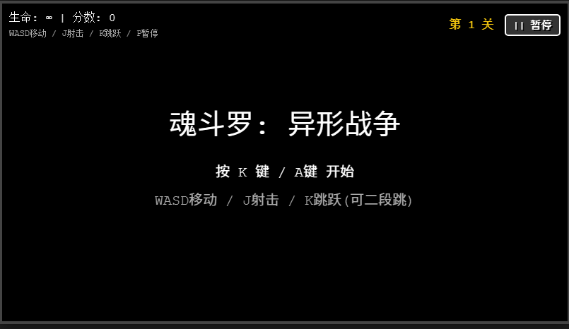
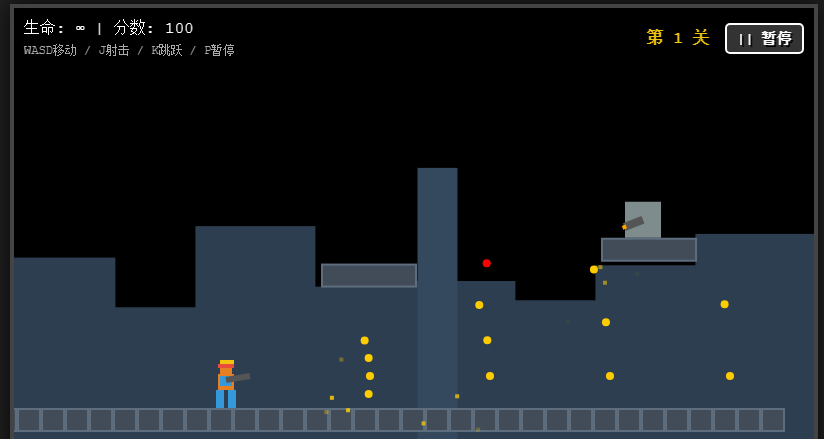
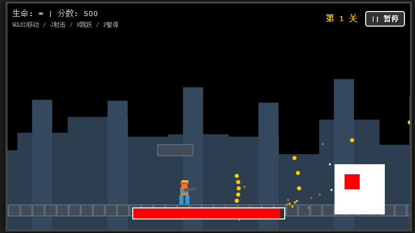

# 像素魂斗罗 - 异形战争

一个致敬经典 8-bit 时代《魂斗罗》风格的单文件 HTML5 横版射击游戏。无需安装，无需外部资源，打开浏览器即可游玩！







## 游戏简介

像素魂斗罗 - 异形战争是完全使用原生 HTML、CSS 和 JavaScript 编写的网页游戏。它复刻了经典的“跑动射击”（Run and Gun）玩法，包含跳跃、射击、躲避以及激烈的 Boss 战。

项目的核心目标是零依赖（Zero Dependencies），所有的图形（像素画）、音效（合成器）和逻辑都包含在一个单独的 .html 文件中。

## 主要特性

+ 单文件架构：所有代码都在一个 HTML 文件中，下载即玩，极易部署。
+ 经典玩法：默认配备强力的散弹枪（S弹），支持8方向瞄准，二段跳功能增加操作灵活性，无限生命模式专注于爽快感。
+ 5个独特的关卡与Boss：
  1. 基地外围 - Boss：守卫炮台
  2. 机械工厂 - Boss：跳跃机甲坦克
  3. 异形巢穴 - Boss：触手异形（程序化触手动画）
  4. 核心通道 - Boss：旋转防御者
  5. 最终核心 - Boss：异形之心
+ 全平台支持：PC端支持键盘操作与暂停；移动端内置虚拟手柄（十字键 + AB键），支持强制横屏模式，完美适配手机游玩。
+ 内置合成音效：使用 Web Audio API 实时生成复古的 8-bit 音效，无需加载任何 MP3/WAV 文件。
+ 视差滚动背景：多层背景滚动，营造伪 3D 的纵深感。
+ 高度可定制：支持通过简单的代码修改替换 Boss 图片。

## 操作说明

### PC 键盘操作

| 按键          | 功能        | 备注                      |
| ------------- | ----------- | ------------------------- |
| W / A / S / D | 移动 / 瞄准 | W 朝上，S 趴下/朝下       |
| J             | 射击        | 支持按住连发              |
| K             | 跳跃        | 空中再次按 K 可进行二段跳 |
| P             | 暂停        | 暂停/继续游戏             |


### 移动端触屏操作

+ 左侧虚拟摇杆：控制移动和瞄准方向。
+ 右侧按键：A（蓝色）对应跳跃，B（红色）对应射击。
+ 右上角按钮：暂停游戏。

注意：在手机上打开时，游戏会自动强制旋转画面，请横屏握持手机以获得最佳体验。

## 如何运行

1. 直接运行：下载仓库中的 contra_game_v5.html 文件，直接用现代浏览器（Chrome、Edge、Safari、Firefox）打开该文件即可。
2. 本地服务器（推荐）：虽然直接打开也能运行，但为了避免某些浏览器的跨域安全策略限制（如果想加载自定义图片），建议使用 VS Code 的 “Live Server” 插件或 Python 简单的 HTTP 服务器运行，命令为 `python -m http.server`。

## 自定义 Boss 图片

虽然游戏内置了程序化绘制的 Boss，但支持将其替换为喜欢的图片（例如更真实的像素图），操作步骤如下：

1. 准备 Boss 图片（推荐 PNG 格式，背景透明）。
2. 打开 contra_game_v5.html 源码。
3. 在脚本最上方找到 CUSTOM_BOSS_IMAGES 配置项：

```javascript
const CUSTOM_BOSS_IMAGES = {
  level1: 'images/boss1.png', // 替换为你的图片路径
  level2: '',
  level3: 'https://example.com/alien_boss.png',
  level4: '',
  level5: ''
};
```

如果路径有效，游戏会自动加载图片覆盖默认的 Boss 绘制逻辑。

## 贡献与开源

这是一个开源项目，欢迎提交 Issue 或 Pull Request 来改进游戏机制、增加新关卡或优化代码结构。

## 许可证

本项目基于 MIT License 开源。你可以免费用于学习、修改或商业用途，只需保留原作者的版权声明。

